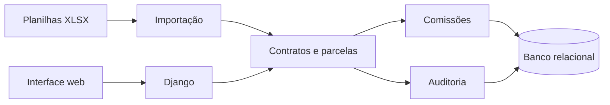

# CRM de contratos e consórcios

> Sistemas e regras de negócio · Estudo de caso técnico

**Python · Django · Django REST Framework · PostgreSQL · Celery · Redis · OpenPyXL · Docker**

## O problema

A gestão de contratos em planilhas dificulta manter parcelas, pagamentos, comissões e alterações vinculados a um histórico consistente.

## A solução

Um CRM organizado em módulos de contas, contratos, comissões e auditoria, com serviços de negócio, migrações e importação de planilhas.

## Funcionalidades representadas

- Gestão de contratos e parcelas.
- Módulo de comissões com regras configuráveis.
- Importação de efetividade a partir de XLSX.
- Contas, formulários e serviços de acesso.
- Histórico de auditoria e migrações de banco.

## Arquitetura

## Decisões técnicas

| Estrutura representada | Finalidade |
| :--- | :--- |
| Módulos por domínio | Separar contas, contratos, comissões e auditoria. |
| Histórico preservado | Alterar o estado atual sem apagar o histórico operacional. |
| Comissões configuráveis | Representar vigências e regras como parte do domínio. |
| Importação e reconciliação | Usar planilhas como entrada e centralizar o estado operacional no sistema. |

As finalidades são uma interpretação técnica da estrutura e dos princípios documentados localmente.

## Estado e limites

Projeto em desenvolvimento. README, dependências e módulos accounts, contracts, commissions e audit foram inspecionados. Uma dependência presente não comprova uso em produção. Execução, homologação e implantação não foram verificadas neste estudo.

## Publicação

Estudo documental sem código original, dados de clientes, bancos, credenciais ou regras específicas. O diagrama é um resumo de apresentação. Não há demonstração executável ou métricas de impacto publicadas.

[Voltar ao portfólio](../../README.md)
