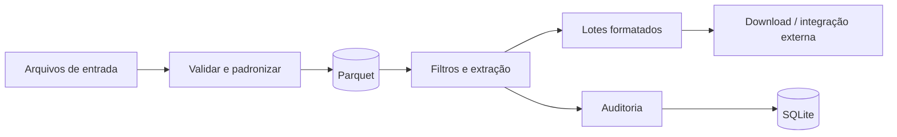

# Higienização e integração de dados

> Engenharia de dados aplicada · Estudo de caso técnico

**Python · FastAPI · Polars · PyArrow · DuckDB · Parquet · SQLite · React**

## O problema

Bases recebidas em planilhas precisam de validação, padronização e segmentação antes de serem utilizadas por uma operação comercial.

## A solução

Um fluxo dividido em três motores: receber e padronizar dados; aplicar filtros e extrair lotes; formatar e integrar os lotes com uma plataforma de discagem.

## Funcionalidades representadas

- Leitura, validação e padronização de arquivos.
- Processamento tabular com Polars e armazenamento Parquet.
- Filtros e orquestração de extrações.
- Modelos e formatadores para diferentes saídas.
- Cliente de integração externa e serviço de auditoria.

## Arquitetura

## Decisões técnicas

| Estrutura representada | Finalidade |
| :--- | :--- |
| Motores separados | Distinguir ingestão, seleção e entrega de dados. |
| Parquet | Adotar armazenamento colunar para o processamento tabular. |
| SQLite operacional | Separar configurações e auditoria das bases de processamento. |

As finalidades são uma interpretação técnica da estrutura local, não uma transcrição de decisões formais.

## Estado e limites

Estudo documental baseado no README, dependências e módulos locais de leitura, validação, padronização, filtros, formatadores e auditoria. Execução e implantação não foram verificadas. Tempos de processamento, volumes suportados e ganhos percentuais não foram medidos nesta publicação.

## Publicação

Não inclui código original, dados de clientes, bancos, credenciais ou regras específicas. O diagrama é um resumo de apresentação. Não há demonstração executável.

[Voltar ao portfólio](../../README.md)
