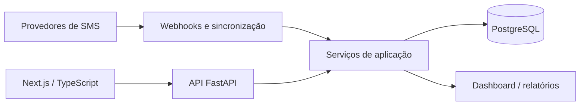

# Central SMS

> Integrações e operação · Estudo de caso técnico

**Python · FastAPI · SQLAlchemy · Alembic · PostgreSQL · Redis · Next.js · TypeScript**

## O problema

Respostas e eventos de SMS chegam de provedores diferentes e precisam virar atendimentos organizados por campanha e equipe.

## A solução

Uma plataforma com API e interface web separadas, módulos de autenticação, usuários, supervisores, consultores, campanhas e atendimentos, além de serviços para integrar eventos de provedores.

## Funcionalidades representadas

- Autenticação e gerenciamento de sessões.
- Gestão de usuários, supervisores e consultores.
- Organização de campanhas e atendimentos.
- Serviços de webhook e sincronização de respostas e status.
- Módulos de dashboard, exportações e relatórios.

## Arquitetura

## Decisões técnicas

| Estrutura representada | Finalidade |
| :--- | :--- |
| API e interface separadas | Organizar o contrato HTTP e permitir evolução independente. |
| Serviços e ports por domínio | Delimitar autenticação, campanhas, atendimentos e integrações. |
| Migrações com Alembic | Registrar a evolução do esquema do banco. |

As finalidades são uma interpretação técnica da estrutura local, não uma transcrição de decisões formais.

## Estado e limites

Projeto em evolução. A estrutura local contém serviços e migrações além das fases descritas no README original. A presença de um módulo não comprova homologação completa ou prontidão de produção. Execução e implantação não foram verificadas nesta publicação.

## Publicação

Estudo documental baseado no README, módulos e migrações locais. Não inclui código original, dados de clientes, bancos, credenciais ou regras específicas. O diagrama é um resumo de apresentação. Não há demonstração executável ou métricas de desempenho publicadas.

[Voltar ao portfólio](../../README.md)
